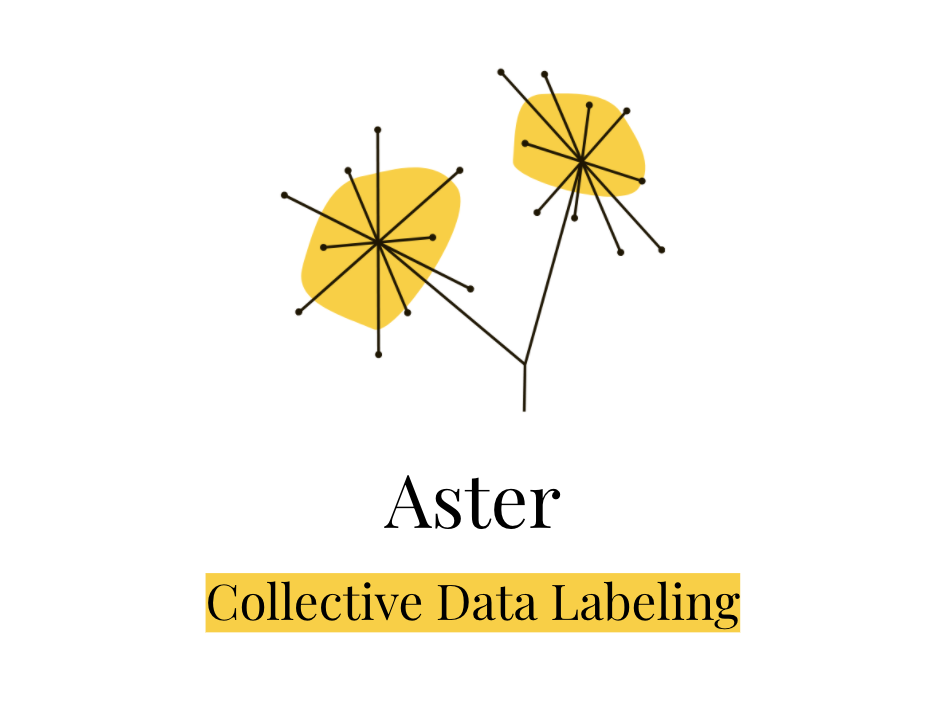

# Aster - Collective Data Labeling

Youtube Demo: https://youtu.be/Jbdv4Z_da8U  
Demo Website: https://aster-38850.web.app/   
[Devpost Home page](https://devpost.com/software/bottomless-data-5dugkp)  
[Presentation Slides](https://docs.google.com/presentation/d/1oWlUDwM8wrVbfX-5lbL_ISHMqj9Rqnhlp8ONFSIhHfs/edit?usp=sharing)

## Our Team

## Inspiration
We’re a group of college students fascinated by the idea of using technology for positive change. With blockchain, we’re able to build applications that are not only useful and sustainable, but also transparent and inclusive. Traditional data labeling applications are opaque and exclusive. There is no transparency in the workflow process to verify the demographics of the workers and fair payments to the workers. Usually, the third-party companies would take a large portion of the profits and leave only a small portion to the workers. By incorporating the blockchain technologies, Aster is able to eliminate the monopolizing third-party companies to provide fair payments to the workers, allow anyone from anywhere in the world to classify data at ease on their mobile phone, and provide clients the opportunities to collect transparent and multi-perspective labels.
  

## What it does
Aster is a decentralized and collective micro-task application for data. Aster enabled transparent data labeling and instant crypto rewards. Aster allows clients to upload data and task description onto our secured backend and create a smart contract on Celo Blockchain for each labeling task to incentivize users from all over the world to help classify data. The clients can view the real-time progress of their tasks on the Aster home dashboard website. The task information and the rewards per task will be displayed on the Aster web and mobile app. The labelers can log onto Aster’s mobile app to select any task they wish to work on. Once a task is completed, labelers receive instant crypto rewards as indicated on the task page.

## How we built it
This project contains both web2.0 and web3.0 technologies. We use Firebase as Aster’s backend to securely store data for clients via NodeJS APIs. We implemented a factory design to allow clients create a new task contract for every data task they want to publish. All payment transactions are through the task smart contracts and are instant. The client frontend UI is a React website application that handles client’s task creations on the Celo blockchain and interacts with Metamask wallets. The labelers, or general users, frontend UI is a React Native mobile application that connects to Valora mobile wallets and handles labelers’ task selection and submission and instant crypto rewards.

## What's next for Aster
Currently, we support only CELO as the crypto payments. We would like to implement the functionalities to support more cryptocurrencies as payments and support more data micro-tasks such as segmentation tasks and description tasks. Moreover, we would also like to provide data analytics to our clients to help them better understand their data distribution and information.

To turn this project into a fully decentralized working solution, we would build a complete and healthy ecosystem for this project community. We need to include a reviewers community in the ecosystem to prevent frauds and ensure the quality of the micro-tasks. This can be done by implementing a decentralized reviewing mechanism on chain to incentivize users to fully support the mission of this project.

## Product Demo

